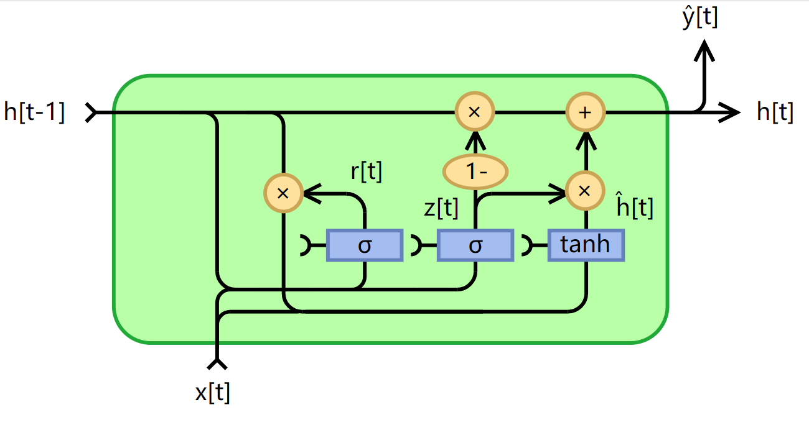

# forward

base unit :
$$
\begin{aligned}
& h_{t} = tanh(W_{hh}h_{t-1} + W_{xh}x_{t} +b_{h}) \\
& y_{t} = W_{hy}h_{t} + b_{y}
\end{aligned}
$$

Gated recurrent units (GRUs) :
$$
\begin{aligned}
& z_{t} = sigmod( W_{z}<x_{t},h_{t-1}> +b_{z}) \\
& r_{t} = sigmod( W_{r}<x_{t},h_{t-1}> +b_{r}) \\
& h_{t} = (1-z_{t}) \circ h_{t-1} + z_{t} \circ tanh(W_{h}<x_t,r_t \circ h_{t-1}> + b_h)
\end{aligned}
$$

